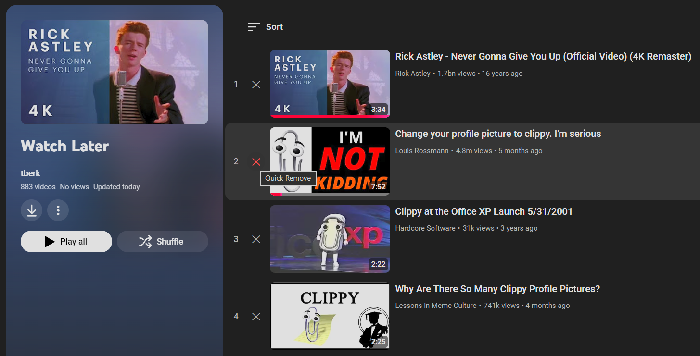

    

# Watch Later Quick Delete for YouTube

A lightweight browser extension designed to streamline your YouTube "Watch Later" management.

Skip the tedious two-click menu process and remove videos with a single click. This extension adds a dedicated **(X)** button directly into the video row.

## ✨ Features
* **One-Click Removal**: Deletes videos immediately.
* **Theme Aware**: Adapts to YouTube's Light and Dark modes.
* **Native Integration**: Blends into the YouTube UI layout.
* **Lightweight**: Zero dependencies, uses `MutationObserver`.

## 🌐 Compatibility
Compatible with all **Chromium-based browsers**:
* Google Chrome, Microsoft Edge, Brave, Vivaldi, Opera, Yandex Browser, etc.

## 🛠 Installation (Developer Mode)
1. Download this repository.
2. Go to `chrome://extensions`.
3. Enable **"Developer mode"**.
4. Click **"Load unpacked"** and select this folder.

## 📖 Usage
1. Go to your [Watch Later playlist](https://www.youtube.com/playlist?list=WL).
2. Click the **✕** icon next to the video number to remove it.

    

